# Générateur de textes — Mastra + Albert IA

Workflow multi-agents qui génère un texte original sur un sujet extrait d'une page web, rédigé dans le style d'un auteur académique donné. Il repose sur le framework [Mastra.js](https://mastra.ai) et le service IA souverain [Albert (Etalab)](https://albert.api.etalab.gouv.fr).

---

## Table des matières

1. [Architecture générale](#architecture-générale)
2. [Structure du projet](#structure-du-projet)
3. [Pipeline du workflow](#pipeline-du-workflow)
4. [Agents](#agents)
5. [Tools](#tools)
6. [Schémas de données](#schémas-de-données)
7. [Configuration](#configuration)
8. [Installation et lancement](#installation-et-lancement)
9. [Application cliente web](#application-cliente-web)
10. [Dépendances](#dépendances)

---

## Architecture générale

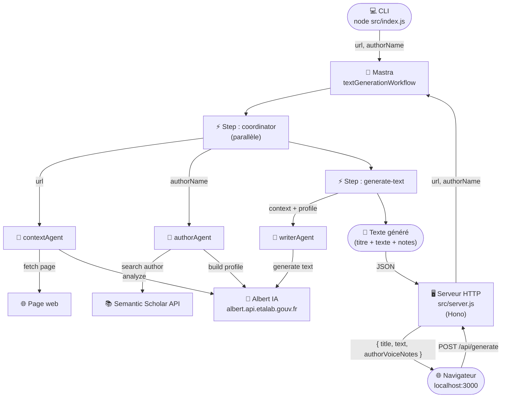

---

## Structure du projet

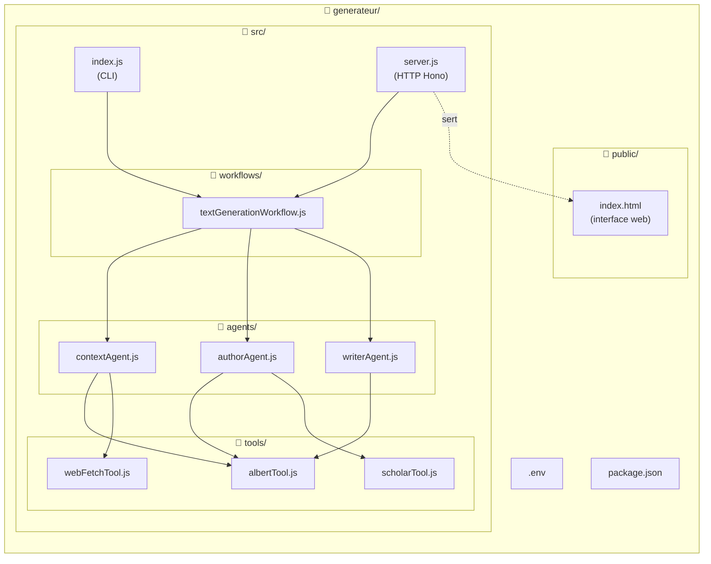

---

## Pipeline du workflow

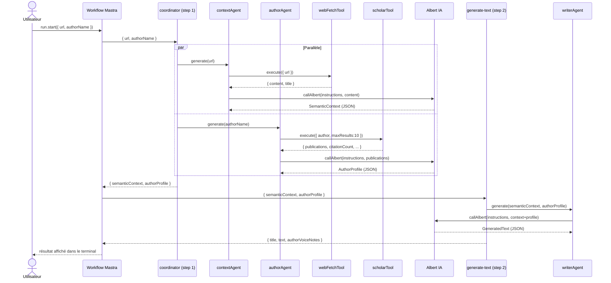

> Le même workflow est également accessible via le serveur HTTP (voir [Application cliente web](#application-cliente-web)).

---

## Agents

Les agents sont des modules JavaScript légers. Chacun encapsule un prompt système et une fonction `generate()` qui orchestre ses tools puis appelle Albert.

### contextAgent

**Rôle** : extraire le contexte sémantique d'une page web.

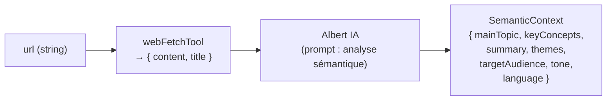

| Champ de sortie | Type | Description |
|---|---|---|
| `mainTopic` | string | Sujet central de la page |
| `keyConcepts` | `{term, definition}[]` | 5–10 concepts-clés |
| `summary` | string | Synthèse en 3–5 phrases |
| `themes` | string[] | 3–5 thèmes transversaux |
| `targetAudience` | string | Public visé |
| `tone` | string | Registre rhétorique |
| `language` | string | Langue détectée |

---

### authorAgent

**Rôle** : construire un profil d'auteur à partir de ses publications sur Semantic Scholar.

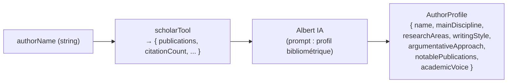

| Champ de sortie | Type | Description |
|---|---|---|
| `name` | string | Nom complet |
| `mainDiscipline` | string | Discipline principale |
| `researchAreas` | string[] | 3–6 domaines de recherche |
| `writingStyle` | string | Style d'écriture typique |
| `argumentativeApproach` | string | Mode d'argumentation |
| `notablePublications` | `{title, year}[]` | Top 3 publications |
| `academicVoice` | string | Personnalité intellectuelle |

---

### writerAgent

**Rôle** : rédiger un texte original en adoptant la voix de l'auteur sur le sujet du contexte.

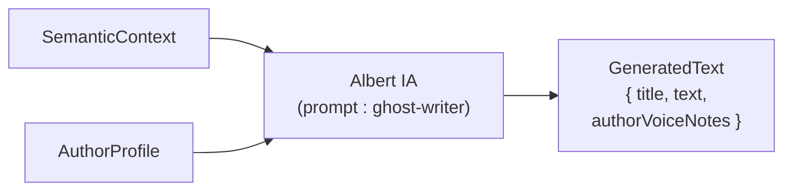

| Champ de sortie | Type | Description |
|---|---|---|
| `title` | string | Titre du texte généré |
| `text` | string | Texte original (400–600 mots) |
| `authorVoiceNotes` | string | Explication de l'application du style |

---

## Tools

### albertTool

Encapsule le client OpenAI pointant sur l'API Albert. Exporte deux interfaces :

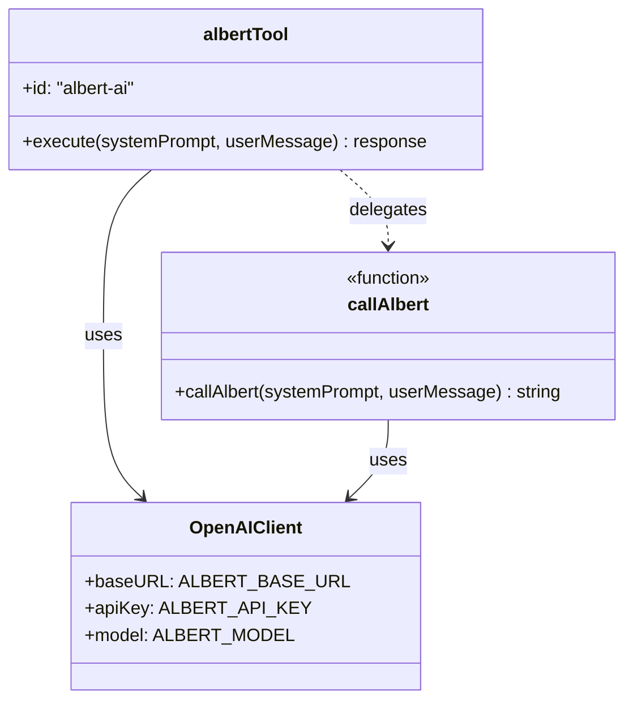

| Export | Usage |
|---|---|
| `callAlbert(sys, msg)` | Appel direct depuis les agents |
| `albertTool` | Mastra `createTool` enregistrable dans le registry |

**Configuration (`.env`) :**

```
ALBERT_BASE_URL=https://albert.api.etalab.gouv.fr/v1
ALBERT_API_KEY=<votre clé>
ALBERT_MODEL=openai/gpt-oss-120b
```

Modèles disponibles sur Albert :

| Modèle | Usage recommandé |
|---|---|
| `openai/gpt-oss-120b` | Usage général (défaut) |
| `mistralai/Mistral-Small-3.2-24B-Instruct-2506` | Tâches légères |
| `Qwen/Qwen3-Coder-30B-A3B-Instruct` | Code |

---

### webFetchTool

Récupère et nettoie le contenu textuel d'une page web.

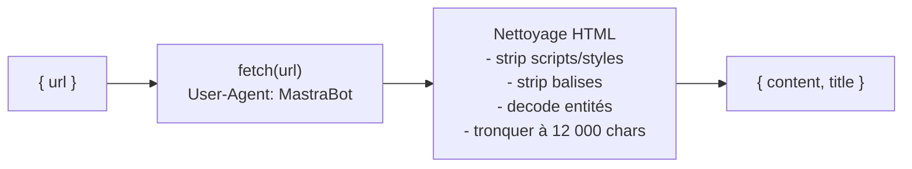

| Paramètre | Type | Description |
|---|---|---|
| `url` | string (URL) | Page à récupérer |

| Retour | Type | Description |
|---|---|---|
| `title` | string | Titre `<title>` de la page |
| `content` | string | Texte nettoyé (max 12 000 car.) |

---

### scholarTool

Interroge l'[API Semantic Scholar](https://api.semanticscholar.org) (gratuite, sans clé) en deux requêtes.

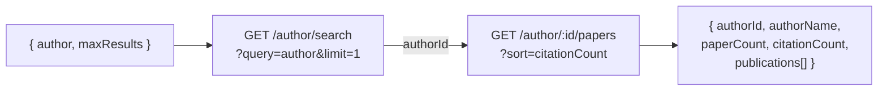

| Paramètre | Type | Défaut | Description |
|---|---|---|---|
| `author` | string | — | Nom de l'auteur |
| `maxResults` | int (1–20) | 10 | Nombre de publications |

| Retour | Type | Description |
|---|---|---|
| `authorId` | string | Identifiant Semantic Scholar |
| `authorName` | string | Nom résolu |
| `paperCount` | number | Nombre total de publications |
| `citationCount` | number | Citations totales |
| `publications[]` | object[] | Liste triée par citations |

---

## Schémas de données

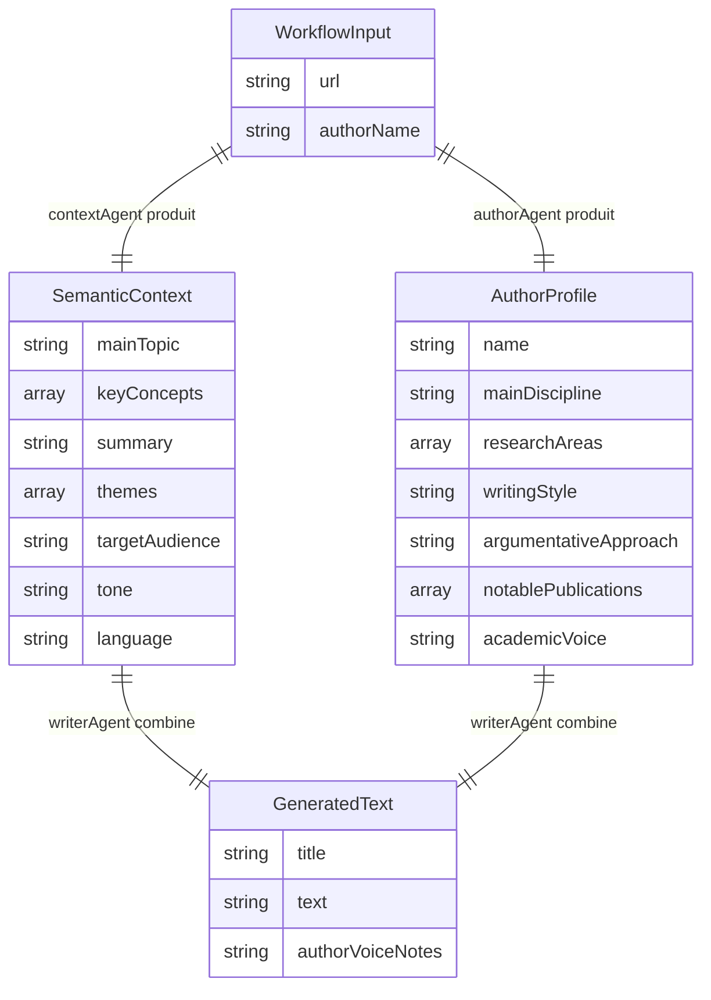

---

## Configuration

Créer un fichier `.env` à la racine :

```dotenv
ALBERT_BASE_URL=https://albert.api.etalab.gouv.fr/v1
ALBERT_API_KEY=<votre clé API Albert>
ALBERT_MODEL=openai/gpt-oss-120b
```

La clé API est obtenue sur [albert.api.etalab.gouv.fr](https://albert.api.etalab.gouv.fr).

---

## Installation et lancement

```bash
npm install
```

### Mode CLI

Lance le workflow directement dans le terminal.

```bash
# Valeurs par défaut (Wikipedia/Web sémantique + Tim Berners-Lee)
npm start

# Avec vos paramètres
node src/index.js "<URL>" "<Nom Auteur>"

# Exemples
node src/index.js "https://fr.wikipedia.org/wiki/Web_sémantique" "Bruno Bachimont"
node src/index.js "https://www.lemonde.fr/article-exemple" "Yann LeCun"
```

**Sortie dans le terminal :**

```
=== Text Generation Workflow ===
Source URL  : https://fr.wikipedia.org/wiki/Web_sémantique
Author      : Bruno Bachimont
================================

TITLE: ...

TEXT:
...

AUTHOR VOICE NOTES:
...
```

### Mode serveur web

Vérifie si le serveur est lancé

MAC
```bash
lsof -Pi :3000
```
LINUX
```bash
netstat -nlp | grep :3000
```

Stop le serveur par son id process
```bash
$ kill -9 1073
```

Lance le serveur HTTP et l'interface graphique.

```bash
npm run server
```

Puis ouvrir **http://localhost:3000** dans un navigateur.

Le port peut être personnalisé via la variable d'environnement `PORT` :

```bash
PORT=8080 npm run server
```

---

## Application cliente web

Le serveur (`src/server.js`) expose deux routes :

| Route | Méthode | Description |
|---|---|---|
| `/` | GET | Sert `public/index.html` |
| `/api/generate` | POST | Exécute le workflow et renvoie le JSON |

### Requête `POST /api/generate`

```json
{
  "url": "https://fr.wikipedia.org/wiki/Intelligence_artificielle",
  "authorName": "Yann LeCun"
}
```

### Réponse (succès `200`)

```json
{
  "title": "...",
  "text": "...",
  "authorVoiceNotes": "..."
}
```

### Réponse (erreur `500`)

```json
{
  "error": "Workflow échoué",
  "status": "failed",
  "steps": [{ "step": "coordinator", "error": "..." }]
}
```

### Interface web (`public/index.html`)

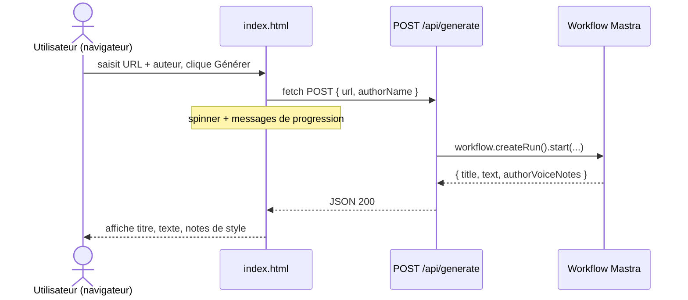

L'interface ne dépend d'aucune librairie externe — HTML/CSS/JS vanilla uniquement.

---

## Dépendances

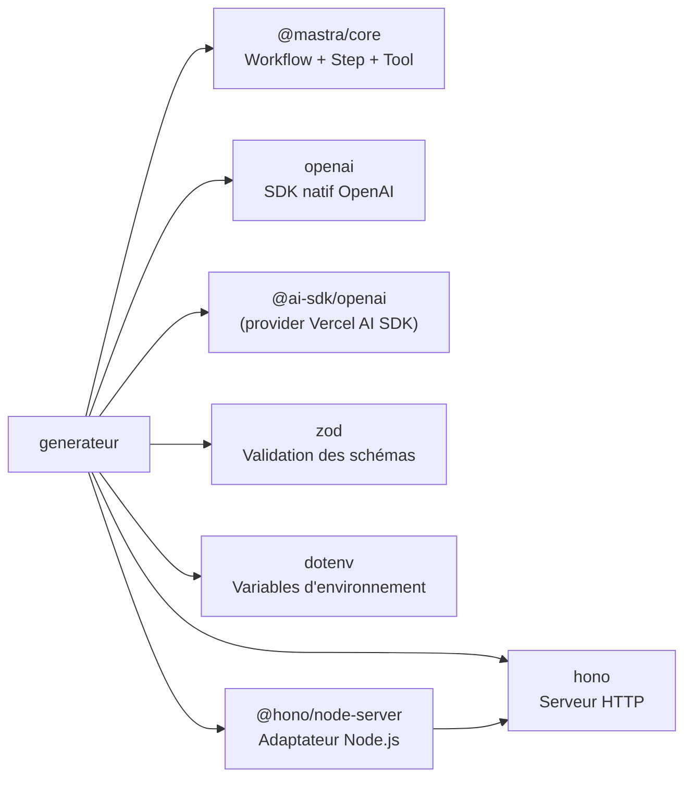

| Package | Version | Rôle |
|---|---|---|
| `@mastra/core` | ^1.35 | Framework workflow/agent |
| `openai` | ^6.38 | Client Albert IA (SDK natif) |
| `@ai-sdk/openai` | ^3.0 | Provider Vercel AI SDK |
| `zod` | ^3.25 | Validation des schémas I/O |
| `dotenv` | ^17.4 | Chargement des variables `.env` |
| `hono` | ^4.12 | Routeur HTTP léger (serveur web) |
| `@hono/node-server` | ^1.19 | Adaptateur Node.js pour Hono |
